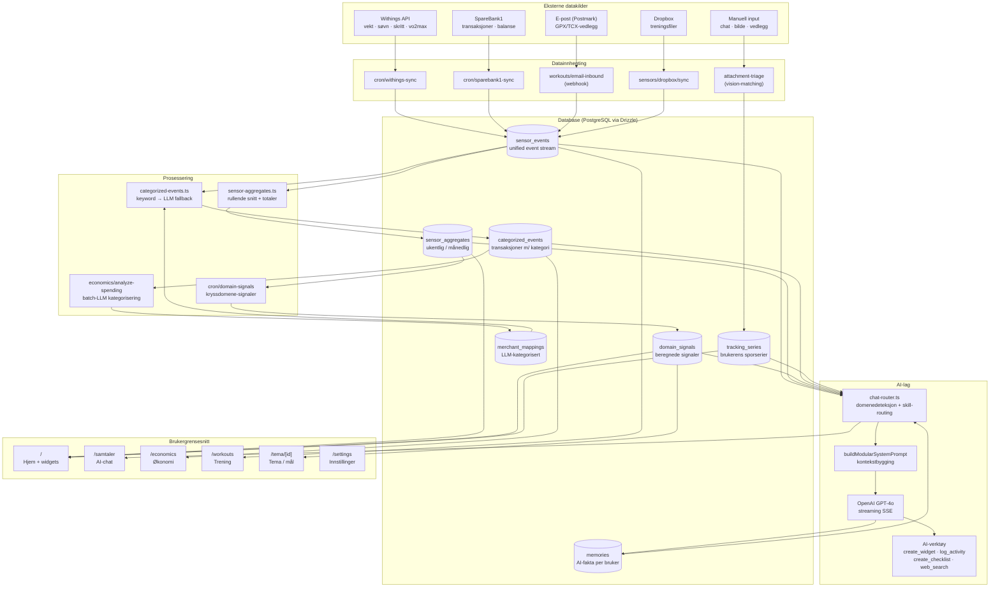
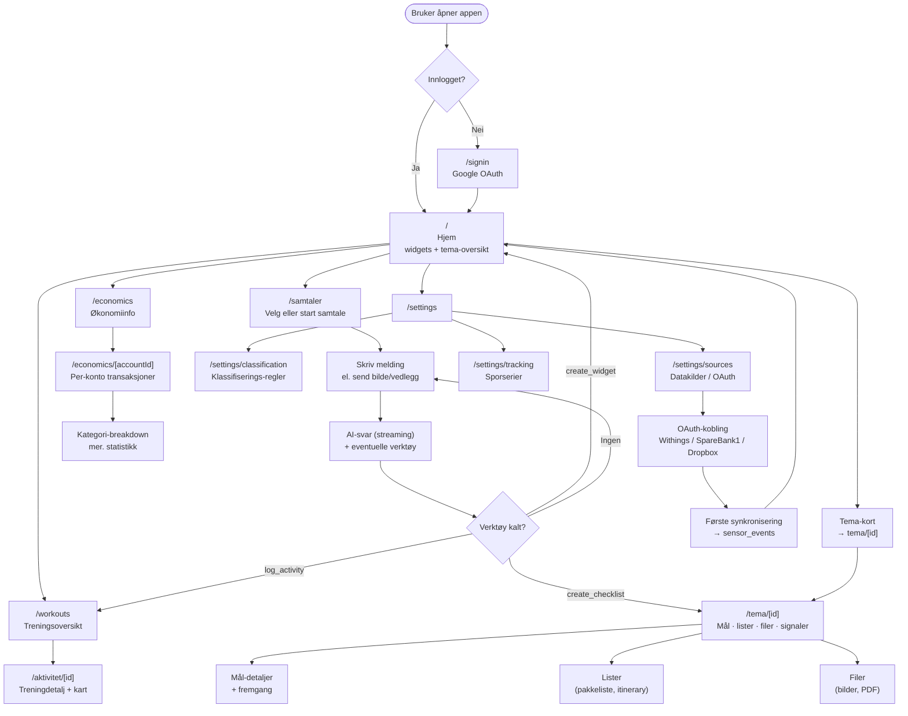

# Resonans — Dataflyt & Brukerflyter

## 1. System-arkitektur og dataflyt



---

## 2. Brukerflyt



---

## 3. Nøkkel dataflyt-detaljer

### Treningsfil-innhenting (to veier)
```
Email (GPX/TCX-vedlegg)
  → Postmark webhook → /api/workouts/email-inbound
  → parseWorkoutFile()
  → sensor_events (dataType='workout')
  → Push-varsling til bruker

Dropbox-mappe
  → Cron eller manuell trigger → /api/sensors/dropbox/sync
  → listDropboxFolder() → downloadDropboxFile()
  → parseWorkoutFile()
  → sensor_events (dataType='workout')
```

### Bankdata (SpareBank1)
```
SpareBank1 Open Banking (OAuth2)
  → OAuth callback → token lagret i sensors-tabell
  → Cron /api/cron/sparebank1-sync (daglig)
  → fetchSparebank1Transactions()
  → sensor_events (dataType='bank_transaction' | 'bank_balance')
  → categorized-events.ts (materialisert projeksjon)
      → merchant_mappings (LLM, batch ~80 merchants)
      → classification_overrides (manuelle overstyringer)
      → keyword-regler (fallback)
  → categorized_events
```

### AI Chat pipeline
```
Bruker sender melding
  → GET /api/chat-stream?conversationId=...&message=...
  → chat-router.ts: detectPromptFocusModules()
      → domener: health | economics | planning | themes | general
      → skills: widget_creation | checklist_planning | goal_planning | ...
  → buildModularSystemPrompt()
      → henter: sensor-aggregates, domain-signals, memories, tracking-series
  → OpenAI streaming → SSE-events til klient
  → Lagrer assistent-melding i messages-tabell
  → Kan kalle verktøy: create_widget, log_activity, create_checklist, web_search
```

### Vedlegg-triage (bildematching)
```
Bruker sender bilde i chat
  → POST /api/attachment-triage
  → Upload til Cloudinary
  → OpenAI Vision: ekstraher signaler, detekter intensjon
  → tracking-triage.ts: match mot tracking_series
      → beregn bilde-signatur (hash, oppsett, farger, tokens)
      → sammenlign mot tracking_series_examples
  → Ved match: auto-logg eller be om bekreftelse
  → recordTrackingEvent() → sensor_events
```
